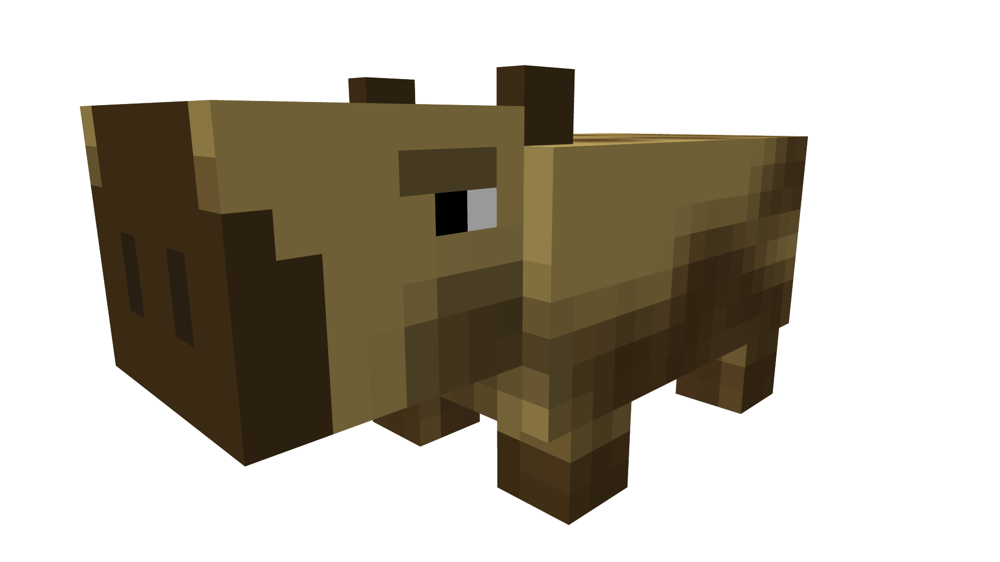

# Bestium



A powerful plugin library for creating custom Minecraft entities with unique behaviors.

Bestium [injects your entity code directly into the Minecraft and Bukkit runtimes](core/src/main/kotlin/cz/jeme/bestium/InjectionUnit.kt).
Unlike traditional methods, it allows
you to create custom entities without extending non-abstract vanilla entities—meaning you're not bound by their existing
implementations.

- [x] Inject custom entity code into the Minecraft and Bukkit runtimes
- [x] Preserve entities over server restarts and chunk unloads
- [x] Craft a nice API with full javadoc
- [x] Integrate [BetterModel](https://github.com/toxicity188/BetterModel) (❤️
  to [toxicity188](https://github.com/toxicity188)) to add custom models to entities
- [x] Full datapack biome support (entities can be added to biomes naturally)
- [x] Mob spawn egg support
- [ ] Mob spawner support
- [ ] In-game spawn command
- [ ] In-game GUI with spawn eggs
- [ ] Config

> [!CAUTION]
> Bestium is currently unstable.

> [!CAUTION]
> Due to frequent changes in Minecraft's internal codebase, Bestium only supports the latest Minecraft release.

## Usage

### Server

Download the [latest release](https://github.com/huzvanec/Bestium/releases/latest) JAR into the `plugins/` folder.

### Code

Add the Bestium API dependency to your project (hosted
on [Maven Central](https://central.sonatype.com/artifact/cz.jeme/bestium)).

Gradle:

```kts
dependencies {
    compileOnly("cz.jeme:bestium:1.0.0")
}
```

Maven:

```xml

<dependencies>
    <dependency>
        <groupId>cz.jeme</groupId>
        <artifactId>bestium</artifactId>
        <version>1.0.0</version>
        <scope>provided</scope>
    </dependency>
</dependencies>
```

> [!TIP]
> Check [here](https://central.sonatype.com/artifact/cz.jeme/bestium/versions) for the latest version.

> [!CAUTION]
> There are no plans for full backward compatibility.

## Building

Requirements:

- [Git](https://git-scm.com/downloads)
- [Java 21](https://www.oracle.com/java/technologies/downloads/#java21)

```bash
git clone https://github.com/huzvanec/Bestium.git
cd Bestium/
./gradlew build
```

Complete JAR is now located in `./build/libs/`.  
API JAR is now located in `./api/build/libs/`.
